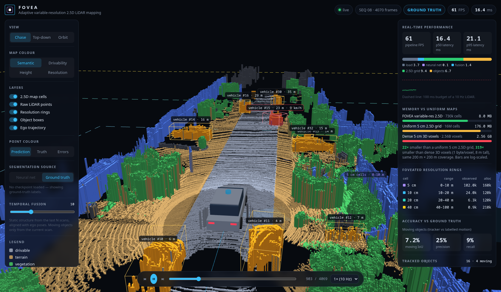
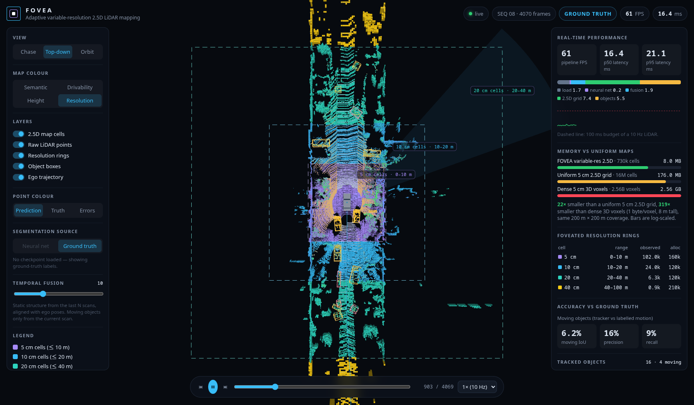
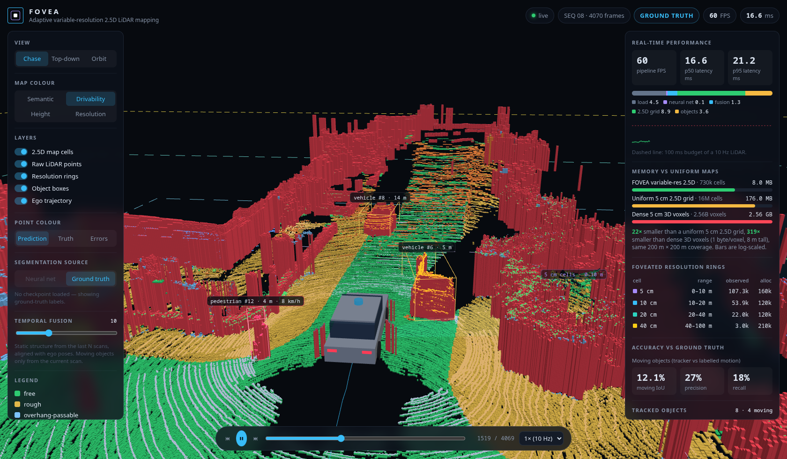

# FOVEA — Adaptive Variable-Resolution 2.5D LiDAR Mapping

**DRDO problem statement 26053 · Smart Vehicles**

FOVEA turns raw LiDAR scans into a *foveated* 2.5D map: 5 cm cells next to the vehicle, coarsening to
40 cm out to 100 m, with semantic layers for drivable terrain, static obstacles and dynamic objects.
A sparse 3D CNN labels every point, a GPU grid engine projects the labelled points into the
variable-resolution map without alignment errors or lost points, and a live simulator shows the map,
the objects and the performance numbers while a recorded drive replays at sensor rate.



| Resolution rings (top-down) | Drivability layer |
|---|---|
|  |  |

## What it does

1. **Terrain analysis** — every cell knows its ground height, whether it is drivable road or
   non-drivable terrain (sidewalk, grass), its step height to neighbouring cells (curbs, pothole rims)
   and the clearance under overhanging structure (branches, barriers).
2. **Object detection** — points are classified into 19 classes, then grouped into *static obstacles*
   (buildings, fences, poles, trunks, signs, vegetation) and *dynamic objects* (vehicles, pedestrians,
   cyclists). Dynamic points are clustered into oriented boxes and tracked across frames; a
   scan-to-scan overlap test separates moving traffic from parked cars.
3. **Adaptive spatial representation** — a nested-ring grid whose cell size doubles with distance,
   built so that every point lands in exactly one cell and coarse cells are exact unions of fine ones.

## Pipeline

```
LiDAR scan (x, y, z, remission)            ~120k points, 10 Hz
   │
   ▼  sparse 3D U-Net (spconv), 5 cm voxels        per-point class + confidence
   │
   ▼  temporal fusion: static points of the last N scans, re-expressed in the current frame
   │  through ego poses; dynamic points only from the current scan (no ghost trails)
   │
   ▼  objects: connected components on dynamic points → oriented boxes → world-frame tracker
   │  → motion state (scan-to-scan voxel overlap + robust track velocity)
   │
   ▼  variable-resolution 2.5D grid engine (GPU scatter-reduce)
   │     count · category · ground height · obstacle top · clearance · step height ·
   │     moving flag · traversability
   ▼
live simulator (FastAPI WebSocket → three.js)  +  benchmark report
```

## The variable-resolution grid

| Ring | Cell size | Area | Cells |
|---|---|---|---|
| L0 | 5 cm | \|x\|,\|y\| < 10 m | 160k |
| L1 | 10 cm | 10–20 m | 120k |
| L2 | 20 cm | 20–40 m | 120k |
| L3 | 40 cm | 40–100 m | 210k |

Why coarser far away is the right call and not just a memory trick: a spinning LiDAR fires at fixed
angles, so the spacing between returns grows linearly with range. A 5 cm cell at 80 m is empty almost
every scan; a 5 cm cell at 5 m sees the curb that matters for safety.

**No alignment error, no data loss — by construction** (`src/lidar/grid.py`):

* Every coordinate is quantised once onto a single integer lattice (5 cm). The ring a point belongs to
  and its cell index inside that ring are both derived from that same integer, so there is no
  floating-point disagreement at ring boundaries and each point lands in exactly one cell.
* Cell-size ratios are integers (×2) and each ring's inner edge is a multiple of the next coarser cell
  size, so a coarse cell is always an exact union of finer cells. Statistics are pooled from a fine
  ring into the coarse ring's inner hole without resampling (used for ground-height filling).
* The tests in `tests/test_grid.py` check all three properties on real scans: point counts are
  conserved, boundary points are assigned consistently, and sum-pooling the 5 cm level reproduces a
  directly-built 40 cm grid bit for bit.

**World-anchored lattice (scrolling rings).** The grid's axes are fixed to the world and its origin
snaps to whole 40 cm steps as the vehicle moves. Every ring's cell size divides 40 cm, so every cell
boundary stays put in the world while the rings follow the vehicle: a wall falls into the same cells
frame after frame instead of being re-binned (and shimmering) whenever the vehicle turns. Measured on
sequence 08: 74 % of occupied 40 cm obstacle cells sit at exactly the same world position in
consecutive frames with the world anchor, 0 % with an ego-aligned grid. Fused points are kept in world
coordinates and re-binned each frame (7 ms for 1.1 M points), so no cell is ever resampled.

**Safety-first pooling.** A coarse cell with 30 road points and 2 pole points is an obstacle cell, not
a road cell: obstacle-like categories claim a cell with ≥ 2 points, so thin obstacles are never
averaged away at long range. Majority vote is used only among ground categories.

**2.5D layers per cell**: point count, semantic category, ground height (mean of ground points,
filled under cars and behind walls by a weighted push–pull pyramid), obstacle top and clearance above
ground, step height to the 3×3 neighbourhood, moving flag and a traversability class
(`free`, `rough`, `overhang-passable`, `step/curb`, `blocked`). An overhang is only marked passable when
the ground beneath it was actually observed, so a wall with an occluded base is never mistaken for a
gap.

## Results

Measured on SemanticKITTI sequence 08 (the standard validation sequence, 4071 scans) on an
RTX 5060 Ti. Full numbers: `docs/results/results.json` (regenerate with `python -m lidar.bench`).

**Memory, same 200 m × 200 m coverage**

| Representation | Cells | Size |
|---|---|---|
| **FOVEA variable-resolution 2.5D** | 0.73 M | **8.0 MB** |
| Uniform 5 cm 2.5D grid | 16 M | 176 MB (22× more) |
| Dense 5 cm 3D voxels, 8 m tall, 1 byte/voxel | 2.56 B | 2.56 GB (319× more) |

**Latency** (mapping stages, per frame, fusion of 10 scans ≈ 1.1 M points):

| Stage | p50 |
|---|---|
| Grid projection, all layers | 7.1 ms |
| Objects + tracking | 2.6 ms |
| Temporal fusion | 1.0 ms |
| Projecting one scan: FOVEA vs uniform 5 cm grid | 5.9 ms vs 39.4 ms |

Segmentation accuracy, accuracy by distance and end-to-end FPS with the network are filled in by
`python -m lidar.bench --checkpoint …` once training finishes (see `docs/results`).

## Running it

Requirements: Linux, an NVIDIA GPU, [uv](https://docs.astral.sh/uv/). Python 3.12, PyTorch 2.11
(CUDA 12.8) and spconv are pinned in `pyproject.toml` / `uv.lock`.

```bash
uv sync
# SemanticKITTI: fetches only the labelled sequences (00-10, ~46 GB) from the official servers,
# sequence 08 first, using HTTP range requests on the 80 GB archive
uv run python scripts/download_semantickitti.py

# live simulator (ground-truth labels until a checkpoint is given)
uv run lidar sim --seq 08 [--checkpoint runs/spunet-5cm/best.pt]
# open http://127.0.0.1:8000   (deep links: ?frame=880&view=top&color=3)

# training (single GPU / multi GPU)
uv run lidar train --root data/semantickitti --out runs/spunet-5cm --mix 0.5 --max-hours 8
uv run torchrun --nproc_per_node=2 -m lidar.train ...

# benchmark, charts, tests
uv run lidar bench --checkpoint runs/spunet-5cm/best.pt --out docs/results --name spunet-5cm
uv run python scripts/make_charts.py docs/results/*.json --out docs/img
uv run pytest -q
```

Training on Kaggle (2× T4, data from the public SemanticKITTI copy, code embedded in the kernel):
`python scripts/kaggle_launch.py --account <name> --name spunet-5cm -- --voxel 0.05 --max-hours 10.5`.

### Simulator controls

`Space` play/pause · `←/→` step · `1–4` map colour (semantic, drivability, height, resolution) ·
views: chase, top-down, orbit · point colours: prediction, ground truth, errors · temporal fusion
slider · source switch between the network and ground-truth labels.

## Repository layout

```
src/lidar/
  labels.py      SemanticKITTI ids → 19 train classes → 7 map categories, colours
  data.py        scans, labels, poses, sparse-voxel training dataset
  models/        sparse 3D U-Net (spconv)
  train.py       training: AMP, DDP, resume, time-budgeted cosine schedule
  infer.py       GPU voxelisation + fp16 inference
  grid.py        variable-resolution 2.5D grid engine
  objects.py     clustering, tracker, motion cue
  pipeline.py    per-frame pipeline used by the simulator and the benchmark
  bench.py       latency / memory / accuracy-by-distance report
  sim/server.py  WebSocket simulator backend
  web/           three.js frontend (vendored, works offline)
scripts/         dataset download, Kaggle launcher, screenshots
tests/           grid invariants
```

## Dataset

[SemanticKITTI](http://www.semantic-kitti.org/) (Behley et al., ICCV 2019) on the KITTI odometry
benchmark (Geiger et al., CVPR 2012), licensed CC BY-NC-SA. Training uses sequences 00–07, 09, 10;
sequence 08 is held out for validation and for every number above.
